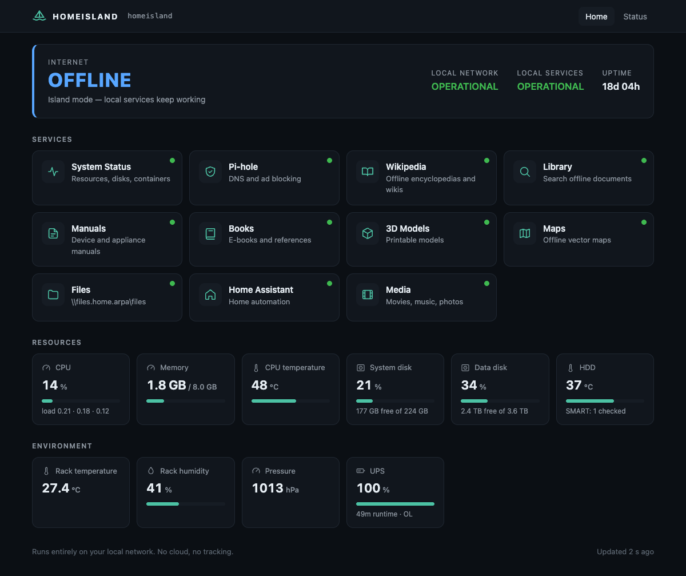

# HomeIsland

**A home network should remain useful even when the Internet does not exist.**

HomeIsland turns a Raspberry Pi 4 (or any small 64-bit Linux box) into an
offline-first home server: local DNS, offline Wikipedia, your own document
library with full-text search, offline maps, file shares, monitoring and a
single dashboard. When the Internet connection disappears — for an hour or for
a month — every local HomeIsland service keeps working.



<sub>Dashboard during an Internet outage (demo data). More screenshots:
[status page](docs/images/status.png) · [offline map](docs/images/maps.png) ·
[library search](docs/images/library.png) · [mobile](docs/images/dashboard-mobile.png)</sub>

- No cloud, no accounts, no telemetry, no analytics, no tracking.
- No external fonts, scripts or CDNs — the web interfaces are fully self-contained
  and enforce this with a Content-Security-Policy.
- Your router stays in charge of DHCP. If HomeIsland fails, your LAN keeps working.

## What you get

| Module | What it does | Default |
|---|---|---|
| **dashboard** | Offline web dashboard at `http://home.home.arpa`, reverse proxy for all services | core |
| **dns** | Pi-hole with local records (`wiki.home.arpa`, …). DHCP stays on the router | core |
| **monitoring** | CPU, RAM, temperatures, disks, SMART, containers, Internet/LAN state | core |
| **backup** | Daily verified configuration backups, one-command restore | core |
| **kiwix** | Offline Wikipedia, Wiktionary, WikiMed, … (ZIM archives) | optional |
| **library** | Your PDFs, EPUBs, Markdown, HTML and text files with full-text search | optional |
| **maps** | Offline vector maps (OpenStreetMap), rendered in the browser | optional |
| **samba** | Password-protected SMB shares on the data disk | optional |
| **homeassistant** | Home Assistant | optional |
| **jellyfin** | Media server | optional |
| **bme280**, **ups**, **fan** | Rack sensor, UPS status (NUT), experimental PWM fan control | optional |

`homeisland module list` shows them all; `homeisland module enable maps` turns one on.

## Requirements

- 64-bit Linux: Raspberry Pi OS Lite (64-bit), Debian 12/13 or Ubuntu 22.04+,
  on ARM64 (reference: Raspberry Pi 4, 8 GB) or x86-64.
- An SSD for the system (strongly recommended over an SD card).
- Optional: a large HDD for datasets, mounted by you (e.g. at `/data`).
- Internet access during installation and whenever you download datasets.

Core services use roughly 100–150 MB of RAM; see [STATUS.md](STATUS.md) for
measured and estimated resource usage.

## Quick start

```sh
sudo git clone https://github.com/ZdenekOndra/home-island.git /opt/homeisland
cd /opt/homeisland
sudo ./install.sh
```

The installer checks the system, installs Docker if needed, asks for the LAN
address, domain, data directory and modules, generates passwords, starts
everything and runs health checks. It never formats disks, never touches your
router and never exposes anything to the Internet.

Then:

1. **Give the server a fixed address** and point your router's DHCP "DNS server"
   option at it — [docs/NETWORKING.md](docs/NETWORKING.md) (MikroTik example in
   [docs/MIKROTIK.md](docs/MIKROTIK.md)).
2. **Download offline data while you are still online** —
   [docs/KNOWLEDGE.md](docs/KNOWLEDGE.md), [docs/MAPS.md](docs/MAPS.md):

   ```sh
   sudo homeisland knowledge download https://download.kiwix.org/zim/wikipedia/<file>.zim
   sudo homeisland maps assets && sudo homeisland maps download cz
   ```
3. **Check readiness**: `homeisland test offline` and `homeisland audit`.

Full guide: [docs/INSTALLATION.md](docs/INSTALLATION.md).

## Everyday commands

```
homeisland status                 overview of system and modules
homeisland health                 live service checks
homeisland test offline           can everything work without Internet?
homeisland audit                  deeper offline-readiness audit with fixes
homeisland module list|enable|disable <name>
homeisland backup | backup list | backup verify latest
homeisland restore latest
homeisland disk status            usage and SMART health
homeisland knowledge list|update|index|download
homeisland maps list|assets|download <region>
homeisland dns                    local DNS records
homeisland logs <service> -f
homeisland update [--rollback]
```

## Architecture in one picture

```
                Internet (optional)
                        │
                     Router ── DHCP for the whole LAN (unchanged)
                        │      DNS option → HomeIsland
                     Switch
          ┌─────────────┼───────────────────────────┐
     phones, laptops    │                      HomeIsland host
                        │     ┌────────────────────────────────────────┐
                        └────►│ :53  Pi-hole ── local records *.home.arpa
                              │ :80  Caddy  ── dashboard, wiki, library, maps, media
                              │ :445 Samba (optional)                  │
                              │ collector (systemd) → status.json      │
                              │ SSD: /etc/homeisland, /var/lib/homeisland
                              │ HDD: /data/homeisland (datasets, backups)
                              └────────────────────────────────────────┘
```

Every service is a separate container with its own restart policy; the
dashboard and DNS never depend on the data disk. Details:
[docs/ARCHITECTURE.md](docs/ARCHITECTURE.md).

## Documentation

| Topic | |
|---|---|
| Installation | [docs/INSTALLATION.md](docs/INSTALLATION.md) |
| Architecture and design decisions | [docs/ARCHITECTURE.md](docs/ARCHITECTURE.md) |
| Networking, DNS, router setup, redundancy | [docs/NETWORKING.md](docs/NETWORKING.md), [docs/MIKROTIK.md](docs/MIKROTIK.md) |
| Storage, data disk, spindown | [docs/STORAGE.md](docs/STORAGE.md) |
| Offline operation, island test, time without NTP | [docs/OFFLINE_MODE.md](docs/OFFLINE_MODE.md) |
| Offline knowledge (Kiwix, library) | [docs/KNOWLEDGE.md](docs/KNOWLEDGE.md) |
| Offline maps | [docs/MAPS.md](docs/MAPS.md) |
| Modules | [docs/MODULES.md](docs/MODULES.md) |
| Backups | [docs/BACKUP.md](docs/BACKUP.md) |
| Disaster recovery | [docs/RECOVERY.md](docs/RECOVERY.md) |
| Security model and hardening | [docs/SECURITY.md](docs/SECURITY.md) |
| Hardware: sensors, UPS, fans, RTC | [docs/HARDWARE.md](docs/HARDWARE.md) |
| Troubleshooting | [docs/TROUBLESHOOTING.md](docs/TROUBLESHOOTING.md) |
| Project status and test coverage | [STATUS.md](STATUS.md) |

## Privacy

HomeIsland has no telemetry, analytics or tracking, needs no account and no
cloud service. The only outbound connections it makes by itself are:

- DNS queries for Internet names, forwarded by Pi-hole to the upstream resolvers you configure;
- TCP handshakes to a few public resolvers to detect whether the Internet is up
  (no data is sent; configurable, can be disabled with `HOMEISLAND_WAN_CHECK=false`);
- Pi-hole blocklist updates.

Dataset and image downloads happen only when you run the corresponding command.
Optional modules that contact external services on their own (Home Assistant,
Jellyfin metadata) are listed by `homeisland audit` and in
[docs/MODULES.md](docs/MODULES.md).

## Contributing

Issues and pull requests are welcome — see [CONTRIBUTING.md](CONTRIBUTING.md).
Please report security problems privately as described in [SECURITY.md](SECURITY.md).

## License

[MIT](LICENSE). Third-party software used by HomeIsland (Pi-hole, Caddy, Kiwix,
MapLibre, Protomaps, Home Assistant, Jellyfin, Samba, …) keeps its own license;
it is downloaded at install time and not redistributed in this repository. Map
data © OpenStreetMap contributors (ODbL).
